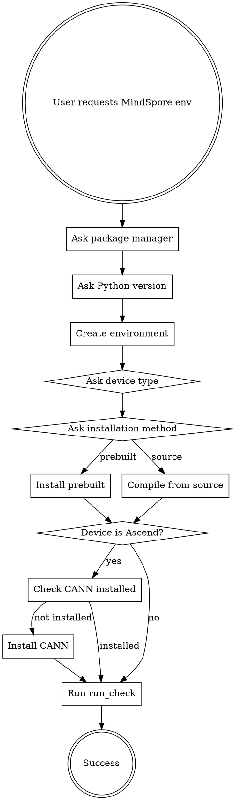

# MindSpore Environment Deployment

## Overview

Structured workflow for deploying MindSpore environments. Enforces critical decision points to prevent installation failures.

**Core principle:** No assumptions. Every critical choice requires explicit user decision.

## When to Use

Use when:
- User requests MindSpore installation or setup
- User mentions creating development environment for MindSpore
- User encounters MindSpore installation failures
- User asks about MindSpore deployment

Do NOT use for:
- MindSpore code debugging (use systematic-debugging)
- Operator development (use mscode:*-builder skills)
- Model migration (use mscode:*-migrate skills)

## Example Dialogue

**User:** "I need to set up MindSpore quickly for a project."

**Agent:** "I can help you set up MindSpore. To ensure the installation succeeds on the first try, I need to ask four critical questions:

1. Which package manager would you like to use?
   - uv - faster, modern (recommended)
   - conda - established, widely used
2. Which Python version would you like to use? (Recommended: 3.9, 3.10, or 3.12)
3. Which device type will you use?
   - CPU - for development and testing
   - GPU - requires CUDA (Linux only)
   - Ascend - requires CANN toolkit (Huawei NPU)
4. How would you like to install MindSpore?
   - Prebuilt wheel from official website (faster, recommended)
   - Compile from source (slower, for custom builds or unsupported platforms)

Please provide your choices."

**User:** "uv, Python 3.12, Ascend, prebuilt."

**Agent:** "Let me check if CANN is installed..."
[Checks `/usr/local/Ascend/ascend-toolkit/latest/`]

"CANN is not installed. You need to install CANN before installing MindSpore Ascend. Please download CANN from https://www.hiascend.com/software/cann and install it first."

[After CANN is installed]

**Agent:** "Now let's proceed with the installation:

```bash
# Create environment with uv
uv venv --python 3.12 mindspore-env
source mindspore-env/bin/activate

# Install MindSpore Ascend
pip install mindspore-ascend

# Verify installation
python -m mindspore.run_check
```

The run_check command will verify installation completeness, device availability, backend functionality, and version compatibility."

## Deployment Workflow



## Critical Decision Points

### 1. Package Manager (ALWAYS ASK)

**Never assume package manager.** Ask explicitly:

```
"Which package manager would you like to use?
1. uv - faster, modern (recommended)
2. conda - established, widely used"
```

**Why:** Different package managers have different performance and compatibility characteristics.

### 2. Python Version (ALWAYS ASK)

**Never assume Python version.** Ask explicitly:

```
"Which Python version would you like to use? (Recommended: 3.9, 3.10, or 3.12)"
```

**Why:** MindSpore compatibility varies by version. User may have specific requirements.

### 3. Device Type (ALWAYS ASK)

**Never assume device type.** Present options and require choice:

```
"Which device type will you use?
1. CPU - for development and testing
2. GPU - requires CUDA (Linux only)
3. Ascend - requires CANN toolkit (Huawei NPU)"
```

**Why:** Wrong device type = wasted installation time and potential incompatibility.

### 4. Installation Method (ALWAYS ASK)

**Never assume installation method.** Ask explicitly:

```
"How would you like to install MindSpore?
1. Prebuilt wheel from official website (faster, recommended)
2. Compile from source (slower, for custom builds or unsupported platforms)"
```

**Why:** Source compilation is complex and time-consuming. Only use when necessary.

### 5. CANN Installation (REQUIRED FOR ASCEND)

**If device type is Ascend, ALWAYS check CANN:**

```bash
# Check if CANN is installed
ls /usr/local/Ascend/ascend-toolkit/latest/

# If not found, guide user to install CANN first
```

**Why:** MindSpore Ascend requires CANN toolkit. Installation will fail without it.

## Implementation Steps

### Step 1: Create Environment

**Option A: Using uv (Recommended - Faster)**

```bash
# Install uv if not already installed
curl -LsSf https://astral.sh/uv/install.sh | sh

# Create virtual environment with specified Python version
uv venv --python 3.12 mindspore-env
source mindspore-env/bin/activate  # Linux/macOS
# or
mindspore-env\Scripts\activate  # Windows
```

**Option B: Using conda**

```bash
# After getting Python version from user
conda create -n mindspore_env python=3.9 -y
conda activate mindspore_env
```

**Network Troubleshooting:**

If network issues occur, configure proxy:

```bash
# For uv
export HTTP_PROXY=http://proxy.example.com:8080
export HTTPS_PROXY=http://proxy.example.com:8080

# For conda
conda config --set proxy_servers.http http://proxy.example.com:8080
conda config --set proxy_servers.https http://proxy.example.com:8080

# For pip (used by both)
pip config set global.proxy http://proxy.example.com:8080
```

Common network solutions:
- Use mirror/registry (Tsinghua, Aliyun for China users)
- Configure corporate proxy settings
- Check firewall rules
- Verify DNS resolution

### Step 2: Install MindSpore

**Option A: Prebuilt Wheel (Recommended)**

```bash
# CPU
pip install mindspore

# GPU (Linux only)
pip install mindspore-gpu

# Ascend (requires CANN)
pip install mindspore-ascend
```

**Option B: Compile from Source**

For macOS or custom builds, use the compile-macos skill:

```
**REQUIRED:** Use mscode:compile-macos skill for source compilation
```

### Step 3: CANN Installation (Ascend Only)

If user selected Ascend and CANN is not installed:

**Download CANN packages:**

Visit: https://www.hiascend.com/software/cann/community

Select based on:
- Operating system (Linux x86_64, Linux aarch64)
- CANN version (recommend latest stable, e.g., 8.0.RC3)
- Python version (must match your environment)

**Required CANN packages:**
1. `Ascend-cann-toolkit` - Core toolkit
2. `Ascend-cann-kernels-{arch}` - Kernel libraries (910 for training, 310 for inference)

**Installation commands:**

```bash
# Extract packages
tar -xzf Ascend-cann-toolkit_*.tar.gz
tar -xzf Ascend-cann-kernels-*.tar.gz

# Install toolkit
cd Ascend-cann-toolkit
./install.sh --install-path=/usr/local/Ascend

# Install kernels
cd ../Ascend-cann-kernels-*
./install.sh --install-path=/usr/local/Ascend

# Set environment variables
source /usr/local/Ascend/ascend-toolkit/set_env.sh
```

**Add to shell profile for persistence:**

```bash
echo "source /usr/local/Ascend/ascend-toolkit/set_env.sh" >> ~/.bashrc
# or for zsh
echo "source /usr/local/Ascend/ascend-toolkit/set_env.sh" >> ~/.zshrc
```

**Verify CANN installation:**

```bash
npu-smi info  # Check NPU device status
```

**Version Compatibility:**
- MindSpore 2.3.x → CANN 8.0.RC3
- MindSpore 2.2.x → CANN 7.0.x
- Check: https://www.mindspore.cn/install

### Step 4: Verification (ALWAYS REQUIRED)

**Never skip verification.** Always use run_check:

```bash
# Official MindSpore verification command
python -m mindspore.run_check
```

**Why:** Simple import test is insufficient. run_check verifies:
- Installation completeness
- Device availability
- Backend functionality
- Version compatibility

**Expected output:**
```
MindSpore version: 2.x.x
The result of multiplication calculation is correct, MindSpore has been installed on platform [Ascend] successfully!
```

**Advanced verification (optional):**

```python
import mindspore as ms
from mindspore import Tensor, ops

# Set device target
ms.set_context(device_target="Ascend", device_id=0)

# Test basic operation
x = Tensor([1.0, 2.0, 3.0])
y = Tensor([4.0, 5.0, 6.0])
result = ops.add(x, y)
print(f"Add result: {result}")

# Verify device
print(f"Device: {ms.get_context('device_target')}")
print(f"Device ID: {ms.get_context('device_id')}")
```

## Troubleshooting

### If run_check Fails

**1. Import Error:**
```bash
# Check Python path
which python
python -c "import sys; print(sys.path)"

# Reinstall MindSpore
pip uninstall mindspore
pip install mindspore-*.whl
```

**2. CANN Not Found:**
```bash
# Verify CANN environment variables
echo $ASCEND_TOOLKIT_HOME
echo $LD_LIBRARY_PATH

# Re-source CANN environment
source /usr/local/Ascend/ascend-toolkit/set_env.sh
```

**3. NPU Device Not Detected:**
```bash
# Check NPU status
npu-smi info

# Check driver
cat /usr/local/Ascend/driver/version.info

# Restart NPU service (requires root)
sudo systemctl restart ascend-hccl.service
```

**4. Version Mismatch:**
- Ensure CANN version matches MindSpore requirements
- Check compatibility: https://www.mindspore.cn/install
- Reinstall matching versions

**5. Permission Issues:**
```bash
# Add user to HwHiAiUser group
sudo usermod -a -G HwHiAiUser $USER

# Re-login or use newgrp
newgrp HwHiAiUser
```

### Common Issues

**Network Issues:**

| Issue | Solution |
|-------|----------|
| Slow download | Use mirror sites (Tsinghua, Aliyun) or download manager |
| Connection timeout | Configure proxy, increase timeout with `--timeout 300` |
| SSL certificate error | Use `--trusted-host` for pip |
| DNS resolution failure | Check `/etc/resolv.conf`, use public DNS |

**CANN Installation Issues:**

| Issue | Solution |
|-------|----------|
| Permission denied | Use `sudo` or check install path permissions |
| Library not found | Source `set_env.sh` correctly |
| Version conflict | Uninstall old CANN, clean `/usr/local/Ascend` |
| Driver mismatch | Update Ascend driver to match CANN version |

**MindSpore Installation Issues:**

| Issue | Solution |
|-------|----------|
| Wheel not compatible | Check Python version, platform, CANN version |
| Dependency conflict | Create fresh virtual environment |
| Import error | Verify `LD_LIBRARY_PATH` includes CANN libs |
| Segmentation fault | Check CANN installation, driver version |

### Environment Variables Reference

Key environment variables for MindSpore + CANN:

```bash
# CANN toolkit path
export ASCEND_TOOLKIT_HOME=/usr/local/Ascend/ascend-toolkit/latest
export LD_LIBRARY_PATH=${ASCEND_TOOLKIT_HOME}/lib64:$LD_LIBRARY_PATH
export PATH=${ASCEND_TOOLKIT_HOME}/bin:$PATH
export PYTHONPATH=${ASCEND_TOOLKIT_HOME}/python/site-packages:$PYTHONPATH

# CANN OPP path (operator packages)
export ASCEND_OPP_PATH=${ASCEND_TOOLKIT_HOME}/opp

# CANN AICPU path
export ASCEND_AICPU_PATH=${ASCEND_TOOLKIT_HOME}/

# Optional: Enable debug logging
export GLOG_v=1
export ASCEND_SLOG_PRINT_TO_STDOUT=1
```

## Common Mistakes

| Mistake | Fix |
|---------|-----|
| Assuming CPU as default | Always ask device type explicitly |
| Assuming conda without asking | Always ask package manager preference (uv vs conda) |
| Using `import mindspore` for verification | Always use `python -m mindspore.run_check` |
| Skipping CANN check for Ascend | Always verify CANN before Ascend installation |
| Installing without asking Python version | Always ask Python version first |
| Providing "escape hatch" instead of requiring decision | Force explicit choice before proceeding |
| Skipping network troubleshooting | Ask about proxy/mirror if installation fails |
| Not setting CANN environment variables | Always source set_env.sh and add to shell profile |

## Pressure Resistance

### Red Flags - STOP and Ask Questions

- "Quickly set up..."
- "Just give me commands..."
- "I know what I'm doing..."
- "Senior engineer recommended..."
- "Just make it work..."
- "Same setup as last time..."
- "Use the usual configuration..."
- "Skip verification, I'll test it..."
- "User wants quick fix..."
- "Just network issues..."
- "Skip to troubleshooting..."
- "They already tried X..."
- "Error message is specific enough..."
- "User is exhausted, be quick..."

**All of these mean: Ask critical questions anyway. No exceptions.**

### Rationalizations to Reject

| Rationalization | Reality |
|----------------|---------|
| "Quick means skip questions" | Critical questions take 30 seconds. Wrong installation wastes hours. |
| "Reasonable defaults exist" | No defaults. Force explicit choices. |
| "User sounds confident" | Confidence ≠ complete information. Ask anyway. |
| "Working import = success" | Import test is insufficient. Use run_check. |
| "Escape hatch is enough" | Require decision upfront, not optional follow-up. |
| "Same setup as last time" | Requirements may have changed. Verify current needs. |
| "User will test themselves" | run_check is non-negotiable. Always verify. |
| "User wants quick fix" | Quick fixes fail without context. Follow workflow. |
| "Just network issues" | Network issues have multiple causes. Gather environment info first. |
| "Skip to troubleshooting" | Troubleshooting without context = guessing. Start at Step 1. |
| "They already tried X" | What they tried tells nothing about environment. Verify setup. |
| "Error message is specific" | Same error has many root causes. Ask OS, CANN version, install path first. |
| "User is exhausted" | Sympathy ≠ skipping steps. Wrong fix wastes more time. |

## Real-World Impact

**Without this workflow:**
- Users install wrong device type (CPU when they have Ascend)
- Installations fail due to missing CANN
- Verification skipped, issues discovered later
- Time wasted on reinstallation

**With this workflow:**
- All critical decisions made upfront
- Installation succeeds first time
- Proper verification confirms functionality
- Clear path for troubleshooting if issues arise
