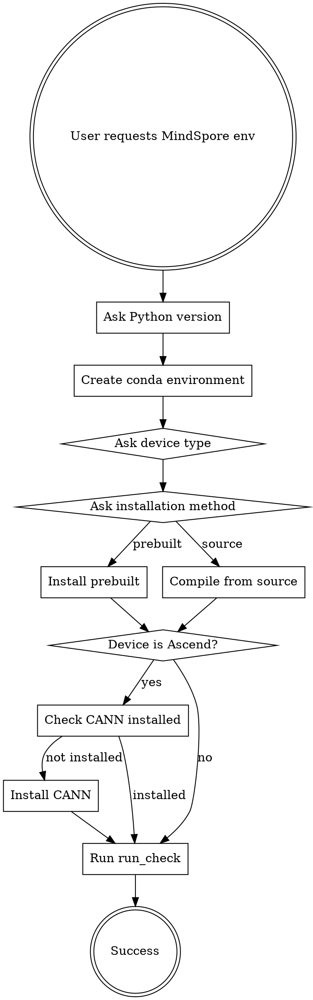

# MindSpore Environment Deployment

## Overview

Structured workflow for deploying MindSpore environments. Enforces critical decision points to prevent installation failures.

**Core principle:** No assumptions. Every critical choice requires explicit user decision.

## When to Use

Use when:
- User requests MindSpore installation or setup
- User mentions creating development environment for MindSpore
- User encounters MindSpore installation failures
- User asks about MindSpore deployment

Do NOT use for:
- MindSpore code debugging (use systematic-debugging)
- Operator development (use mscode:*-builder skills)
- Model migration (use mscode:*-migrate skills)

## Example Dialogue

**User:** "I need to set up MindSpore quickly for a project."

**Agent:** "I can help you set up MindSpore. To ensure the installation succeeds on the first try, I need to ask three critical questions:

1. Which Python version would you like to use? (Recommended: 3.8, 3.9, or 3.10)
2. Which device type will you use?
   - CPU - for development and testing
   - GPU - requires CUDA (Linux only)
   - Ascend - requires CANN toolkit (Huawei NPU)
3. How would you like to install MindSpore?
   - Prebuilt wheel from official website (faster, recommended)
   - Compile from source (slower, for custom builds or unsupported platforms)

Please provide your choices."

**User:** "Python 3.9, Ascend, prebuilt."

**Agent:** "Let me check if CANN is installed..."
[Checks `/usr/local/Ascend/ascend-toolkit/latest/`]

"CANN is not installed. You need to install CANN before installing MindSpore Ascend. Please download CANN from https://www.hiascend.com/software/cann and install it first."

[After CANN is installed]

**Agent:** "Now let's proceed with the installation:

```bash
conda create -n mindspore_env python=3.9 -y
conda activate mindspore_env
pip install mindspore-ascend
python -m mindspore.run_check
```

The run_check command will verify installation completeness, device availability, backend functionality, and version compatibility."

## Deployment Workflow



## Critical Decision Points

### 1. Python Version (ALWAYS ASK)

**Never assume Python version.** Ask explicitly:

```
"Which Python version would you like to use? (Recommended: 3.8, 3.9, or 3.10)"
```

**Why:** MindSpore compatibility varies by version. User may have specific requirements.

### 2. Device Type (ALWAYS ASK)

**Never assume device type.** Present options and require choice:

```
"Which device type will you use?
1. CPU - for development and testing
2. GPU - requires CUDA (Linux only)
3. Ascend - requires CANN toolkit (Huawei NPU)"
```

**Why:** Wrong device type = wasted installation time and potential incompatibility.

### 3. Installation Method (ALWAYS ASK)

**Never assume installation method.** Ask explicitly:

```
"How would you like to install MindSpore?
1. Prebuilt wheel from official website (faster, recommended)
2. Compile from source (slower, for custom builds or unsupported platforms)"
```

**Why:** Source compilation is complex and time-consuming. Only use when necessary.

### 4. CANN Installation (REQUIRED FOR ASCEND)

**If device type is Ascend, ALWAYS check CANN:**

```bash
# Check if CANN is installed
ls /usr/local/Ascend/ascend-toolkit/latest/

# If not found, guide user to install CANN first
```

**Why:** MindSpore Ascend requires CANN toolkit. Installation will fail without it.

## Implementation Steps

### Step 1: Create Conda Environment

```bash
# After getting Python version from user
conda create -n mindspore_env python=3.9 -y
conda activate mindspore_env
```

### Step 2: Install MindSpore

**Option A: Prebuilt Wheel (Recommended)**

```bash
# CPU
pip install mindspore

# GPU (Linux only)
pip install mindspore-gpu

# Ascend (requires CANN)
pip install mindspore-ascend
```

**Option B: Compile from Source**

For macOS or custom builds, use the compile-macos skill:

```
**REQUIRED:** Use mscode:compile-macos skill for source compilation
```

### Step 3: CANN Installation (Ascend Only)

If user selected Ascend and CANN is not installed:

1. Guide user to download CANN from Huawei website
2. Verify CANN version compatibility with MindSpore version
3. Install CANN toolkit
4. Set environment variables

**CANN download:** https://www.hiascend.com/software/cann

### Step 4: Verification (ALWAYS REQUIRED)

**Never skip verification.** Always use run_check:

```bash
# Official MindSpore verification command
python -m mindspore.run_check
```

**Why:** Simple import test is insufficient. run_check verifies:
- Installation completeness
- Device availability
- Backend functionality
- Version compatibility

## Common Mistakes

| Mistake | Fix |
|---------|-----|
| Assuming CPU as default | Always ask device type explicitly |
| Using `import mindspore` for verification | Always use `python -m mindspore.run_check` |
| Skipping CANN check for Ascend | Always verify CANN before Ascend installation |
| Installing without asking Python version | Always ask Python version first |
| Providing "escape hatch" instead of requiring decision | Force explicit choice before proceeding |

## Pressure Resistance

### Red Flags - STOP and Ask Questions

- "Quickly set up..."
- "Just give me commands..."
- "I know what I'm doing..."
- "Senior engineer recommended..."
- "Just make it work..."
- "Same setup as last time..."
- "Use the usual configuration..."
- "Skip verification, I'll test it..."

**All of these mean: Ask critical questions anyway. No exceptions.**

### Rationalizations to Reject

| Rationalization | Reality |
|----------------|---------|
| "Quick means skip questions" | Critical questions take 30 seconds. Wrong installation wastes hours. |
| "Reasonable defaults exist" | No defaults. Force explicit choices. |
| "User sounds confident" | Confidence ≠ complete information. Ask anyway. |
| "Working import = success" | Import test is insufficient. Use run_check. |
| "Escape hatch is enough" | Require decision upfront, not optional follow-up. |
| "Same setup as last time" | Requirements may have changed. Verify current needs. |
| "User will test themselves" | run_check is non-negotiable. Always verify. |

## Real-World Impact

**Without this workflow:**
- Users install wrong device type (CPU when they have Ascend)
- Installations fail due to missing CANN
- Verification skipped, issues discovered later
- Time wasted on reinstallation

**With this workflow:**
- All critical decisions made upfront
- Installation succeeds first time
- Proper verification confirms functionality
- Clear path for troubleshooting if issues arise
